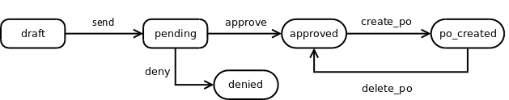

.. image:: https://img.shields.io/badge/licence-AGPL--3-blue.svg
   :alt: AGPL License log

Purchase Request
################

This module is designed to manage equipment o services purchase requests, subject to acceptance by a department leader.

Workflow
--------

The purchase request workflow starts creating a *draft* request. When the user
pushes the ``Send`` button, an email is sent to user's supervisor seeking his/her approval. The supervisor 
or validator will ``accept`` or ``deny`` that purchase request. If accepted, a Purchase Order may be generated. If that 
Purchase Order is deleted, the purchase request will return to ``Accepted`` state.

 

 

Credits
-------

Maintainer
..........

.. image:: http://www.minorisa.net/wp-content/themes/minorisa/img/logo-minorisa.png
   :target: http://www.minorisa.net
   :alt: Minorisa Logo

Contributors
............

* Jaume Planas <jaume.planas@minorisa.net>

